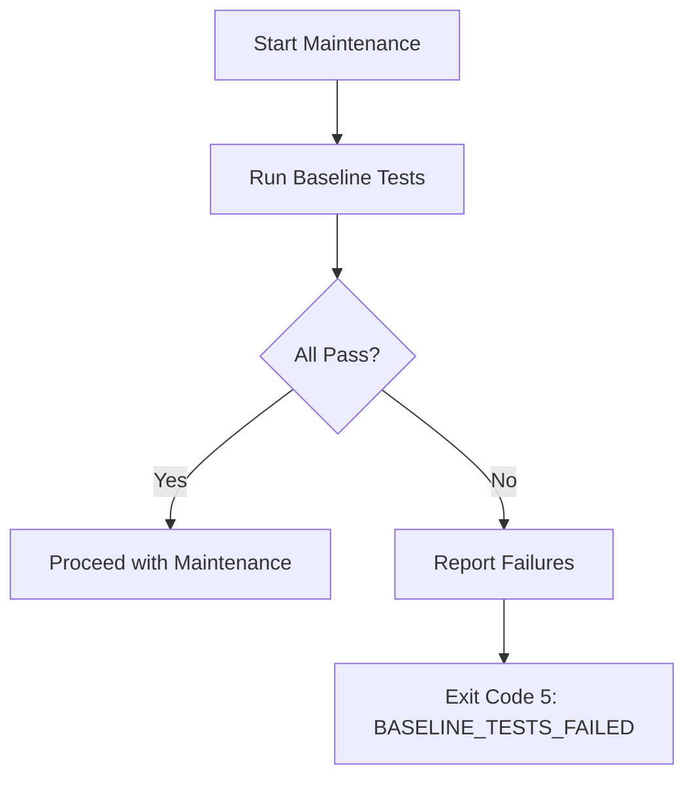
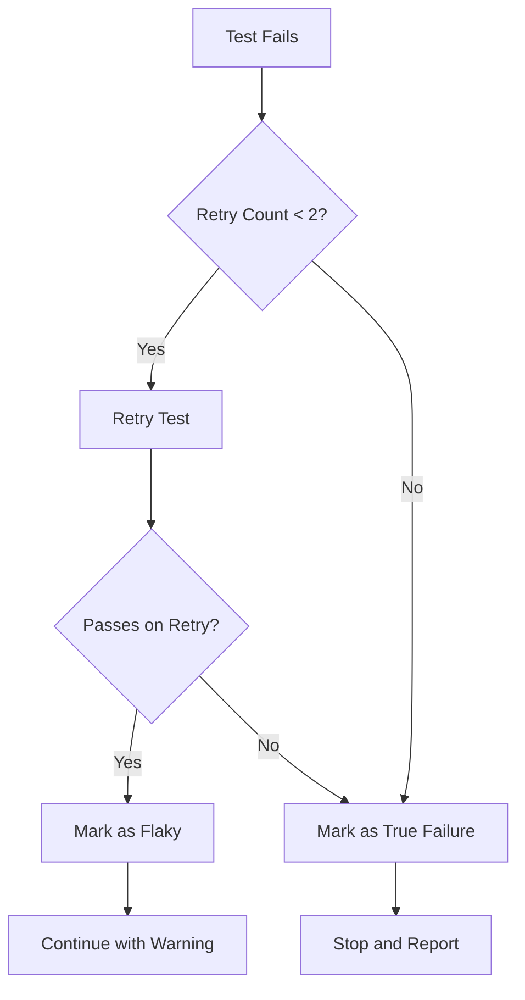

# Testing Strategy

**Purpose**: Define testing requirements, baseline validation, and flaky test handling
**Version**: 1.0.0

---

## Baseline Test Requirements

### Definition

**Baseline tests** are the existing tests in a project that must pass before TestBoost performs any maintenance operations. This ensures we don't introduce regressions.

### Baseline Validation Process

1. **Run existing tests**: Execute `mvn test` on the project
2. **Capture results**: Record pass/fail counts and duration
3. **Validate threshold**: All tests must pass (100% pass rate)
4. **Block on failure**: If baseline fails, abort maintenance



### Baseline Test Configuration

```yaml
# config/agents/maven_maintenance_agent.yaml
baseline_tests:
  enabled: true
  timeout_seconds: 300
  fail_fast: true
  retry_flaky: 2
```

### What Constitutes a Passing Baseline

- All unit tests pass (`mvn test`)
- No compilation errors
- No test failures (failures != errors)
- Execution completes within timeout

### Baseline Failure Recommendations

| Failure Type | Exit Code | Recommended Action |
|--------------|-----------|-------------------|
| Test failures | 5 | Fix failing tests before maintenance |
| Compilation errors | 20 | Fix compilation errors |
| Timeout | 8 | Increase timeout or investigate slow tests |
| Infrastructure | 1 | Check Maven installation, network, etc. |

---

## Flaky Test Handling

### Definition

**Flaky tests** are tests that produce inconsistent results (sometimes pass, sometimes fail) without code changes. They undermine confidence in the test suite.

### Detection Criteria

A test is considered **potentially flaky** if:
- It fails once but passes on retry
- It has historically alternated between pass/fail
- It depends on timing, external services, or random data

### Handling Strategy



### Retry Policy

```yaml
flaky_test_handling:
  max_retries: 2
  retry_delay_seconds: 1
  quarantine_after: 3  # Quarantine after 3 flaky occurrences
```

### Flaky Test Categories

| Category | Detection | Action |
|----------|-----------|--------|
| Timing-dependent | Varies with load | Add retry, log warning |
| Order-dependent | Fails in isolation | Flag for investigation |
| External-dependent | Fails with network issues | Mock or quarantine |
| Random data | Inconsistent with random seeds | Set deterministic seed |

### Reporting Flaky Tests

When flaky tests are detected, TestBoost:

1. **Logs warning**: Records the flaky behavior
2. **Continues execution**: Does not block workflow
3. **Reports in summary**: Includes flaky test list in results
4. **Tracks history**: Maintains flaky test registry

Example output:
```json
{
  "session_id": "abc-123",
  "test_results": {
    "passed": 45,
    "failed": 0,
    "flaky": 2,
    "flaky_tests": [
      "com.example.TimingTest.testSlowOperation",
      "com.example.NetworkTest.testExternalCall"
    ]
  },
  "warnings": [
    "2 tests marked as flaky - consider stabilizing"
  ]
}
```

### Quarantine Strategy

Tests that are flaky 3+ times are automatically quarantined:

1. **Excluded from baseline**: Don't block maintenance
2. **Tracked separately**: Reported in dedicated section
3. **Review required**: Manual intervention needed

---

## Post-Maintenance Validation

### Validation Process

After applying changes, TestBoost validates:

1. **Compilation**: Project still compiles
2. **Baseline tests**: Original tests still pass
3. **New tests**: Generated tests pass
4. **Coverage**: Meets minimum threshold (if configured)

### Validation Failure Handling

| Stage | Failure | Action |
|-------|---------|--------|
| Compilation | Build fails | Rollback all changes |
| Baseline | Regression detected | Rollback, report diff |
| New tests | Generated test fails | Auto-correct (up to 3 attempts) |
| Coverage | Below threshold | Generate additional tests |

### Auto-Correction Loop

For generated tests that fail:

```python
max_correction_attempts = 3

for attempt in range(max_correction_attempts):
    result = run_tests(generated_tests)
    if result.passed:
        break

    # Analyze failure and apply fix
    error_analysis = analyze_test_failure(result)
    apply_correction(error_analysis)
```

---

## Coverage Requirements

### Minimum Thresholds

| Metric | Threshold | Description |
|--------|-----------|-------------|
| Line coverage | 70% | Lines executed by tests |
| Branch coverage | 60% | Decision branches covered |
| Mutation score | 80% | Mutants killed by tests |

### Coverage Tools

- **JaCoCo**: Line and branch coverage
- **PIT**: Mutation testing coverage

### Coverage Validation

```yaml
coverage_requirements:
  line_coverage: 0.70
  branch_coverage: 0.60
  mutation_score: 0.80
  fail_on_decrease: true
```

---

## Test Quality Scoring

TestBoost assigns a quality score (0-120) to generated tests:

| Component | Points | Criteria |
|-----------|--------|----------|
| Compilation | 20 | Test compiles successfully |
| Execution | 20 | Test runs without errors |
| Assertions | 30 | Meaningful assertions present |
| Coverage | 30 | Covers target functionality |
| Mutation | 20 | Kills relevant mutants |

### Score Interpretation

| Score Range | Quality | Action |
|-------------|---------|--------|
| 100-120 | Excellent | Accept as-is |
| 80-99 | Good | Minor improvements optional |
| 60-79 | Acceptable | Consider enhancement |
| < 60 | Poor | Regenerate or manual review |
