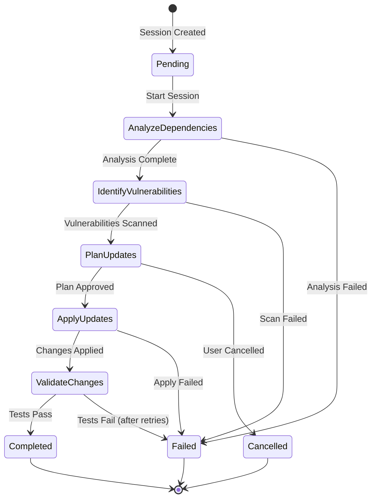
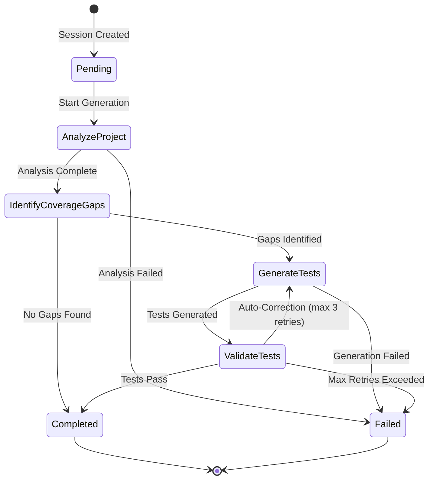
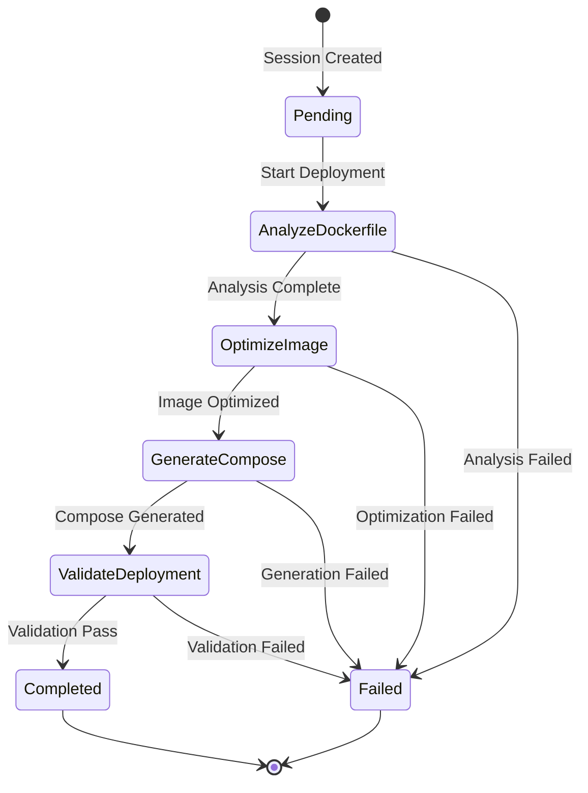
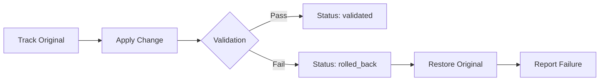
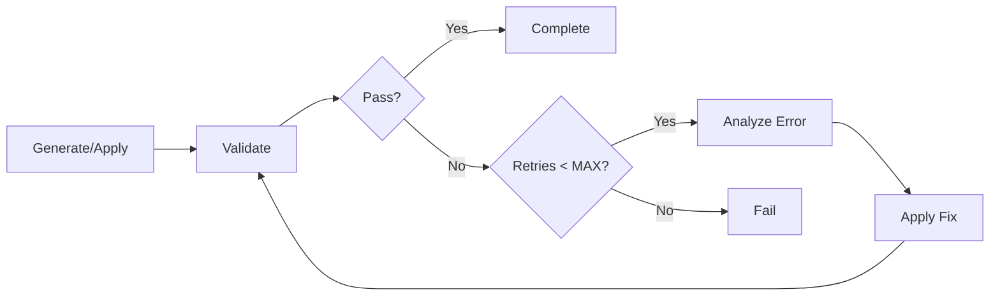
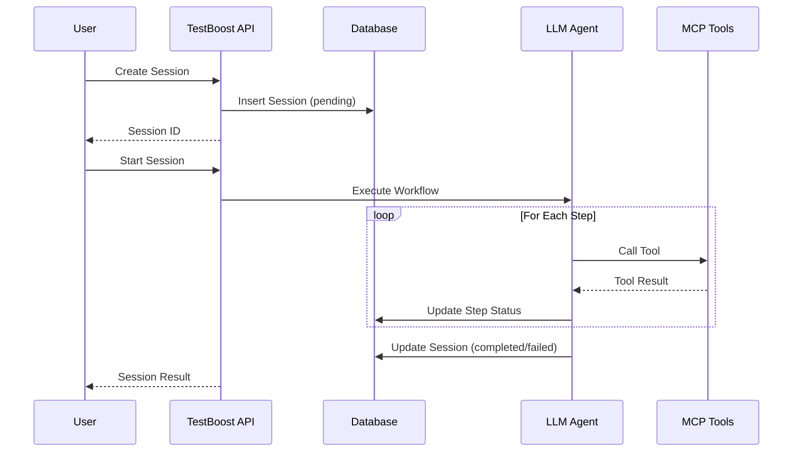

# Workflow Diagrams

**Purpose**: Visual representation of TestBoost workflow state transitions
**Version**: 1.0.0

---

## Maven Maintenance Workflow



### State Descriptions

| State | Description | Exit Criteria |
|-------|-------------|---------------|
| Pending | Session created, awaiting start | User triggers start |
| AnalyzeDependencies | Analyzing project dependencies for outdated packages | Analysis completes or fails |
| IdentifyVulnerabilities | Scanning for security vulnerabilities in dependencies | Scan completes |
| PlanUpdates | Creating update plan with prioritized changes | User approves or rejects |
| ApplyUpdates | Applying dependency updates to project | All changes applied or error |
| ValidateChanges | Running tests to validate changes | Tests pass or fail |
| Completed | Workflow finished successfully | - |
| Failed | Workflow failed with error | - |
| Cancelled | User cancelled workflow | - |

### Transition Conditions

| From | To | Condition |
|------|-----|-----------|
| AnalyzeDependencies | IdentifyVulnerabilities | All dependencies analyzed, no blocking issues |
| AnalyzeDependencies | Failed | Cannot parse pom.xml, invalid project structure |
| IdentifyVulnerabilities | PlanUpdates | Vulnerability scan complete |
| PlanUpdates | ApplyUpdates | User approves plan (interactive) or auto-approve (autonomous) |
| PlanUpdates | Cancelled | User explicitly cancels |
| ApplyUpdates | ValidateChanges | All planned changes successfully applied |
| ApplyUpdates | Failed | Any change fails to apply |
| ValidateChanges | Completed | `mvn test` passes |
| ValidateChanges | Failed | Tests fail after max 3 retry attempts |

### Rollback Handling

> **Note**: Rollback is managed at the **modification level**, not as a session state.
> Each file modification is tracked via `ModificationStatus` enum:
>
> | Status | Description |
> |--------|-------------|
> | `pending` | Modification planned but not applied |
> | `applied` | Modification successfully applied |
> | `validated` | Tests passed after modification |
> | `rolled_back` | Modification reverted due to failure |
> | `failed` | Modification could not be applied |
>
> This allows granular rollback of individual changes while keeping session state simple.

---

## Test Generation Workflow



### State Descriptions

| State | Description | Exit Criteria |
|-------|-------------|---------------|
| Pending | Session created | Start triggered |
| AnalyzeProject | Analyzing project structure and existing tests | Analysis complete |
| IdentifyCoverageGaps | Identifying areas lacking test coverage | Gaps identified or none found |
| GenerateTests | Generating test cases (unit, integration, snapshot) | Tests written |
| ValidateTests | Running and validating generated tests | Tests pass or auto-correct |
| Completed | All tests generated and passing | - |
| Failed | Generation failed | - |

### Agent-Managed Complexity

The LLM agent internally handles advanced features that are not exposed as session steps:

| Feature | Description | Constants |
|---------|-------------|-----------|
| **Auto-Correction** | Fixes compilation errors in generated tests | MAX_CORRECTION_RETRIES = 3 |
| **Test Iterations** | Reruns failing tests with fixes | MAX_TEST_ITERATIONS = 5 |
| **Mutation Analysis** | Analyzes mutation score for coverage quality | Target: 80% |
| **Killer Tests** | Generates tests to kill surviving mutants | Integrated in GenerateTests |

> **Note**: The simplified 4-step workflow delegates complexity to the LLM agent,
> keeping session state management clean while enabling sophisticated test generation.

---

## Docker Deployment Workflow



### State Descriptions

| State | Description | Exit Criteria |
|-------|-------------|---------------|
| Pending | Session created | Start triggered |
| AnalyzeDockerfile | Analyzing existing Dockerfile and configuration | Analysis complete |
| OptimizeImage | Optimizing Docker image size and layers | Optimization complete |
| GenerateCompose | Generating or updating docker-compose configuration | Compose file ready |
| ValidateDeployment | Validating deployment configuration | Validation passes |
| Completed | Deployment configuration ready | - |
| Failed | Deployment preparation failed | - |

> **Note**: This workflow prepares Docker deployment configuration. Actual container deployment
> and health checks are handled by the container runtime, not as session states.

---

## Common Patterns

### Rollback Strategy

File modifications are tracked via the `ModificationStatus` enum, enabling granular rollback:



**ModificationStatus Lifecycle**:

| Status | Trigger | Next States |
|--------|---------|-------------|
| `pending` | Change planned | `applied`, `failed` |
| `applied` | Change written to file | `validated`, `rolled_back` |
| `validated` | Tests pass | Terminal |
| `rolled_back` | Tests fail or error | Terminal |
| `failed` | Cannot apply change | Terminal |

### Auto-Correction Loop

For test generation and maintenance workflows:



**Retry Constants** (defined in workflow agents):

| Constant | Value | Used In | Description |
|----------|-------|---------|-------------|
| `MAX_CORRECTION_RETRIES` | 3 | Test Generation | Max attempts to fix compilation errors |
| `MAX_TEST_ITERATIONS` | 5 | Test Generation | Max test/fix cycles |
| `TEST_TIMEOUT_SECONDS` | 300 | Test Generation | Timeout per test run |
| `max_attempts` | 3 | Maven Maintenance | Retry with exponential backoff |
| `base_delay` | 2.0s | Maven Maintenance | Base delay for backoff |

### Exponential Backoff

Network operations use exponential backoff for resilience:

```python
# Pattern used in agents
@retry_with_backoff(max_attempts=3, base_delay=2.0)
async def call_external_service():
    # Delays: 2s, 4s, 8s before failing
    ...
```

---

## Session Lifecycle


