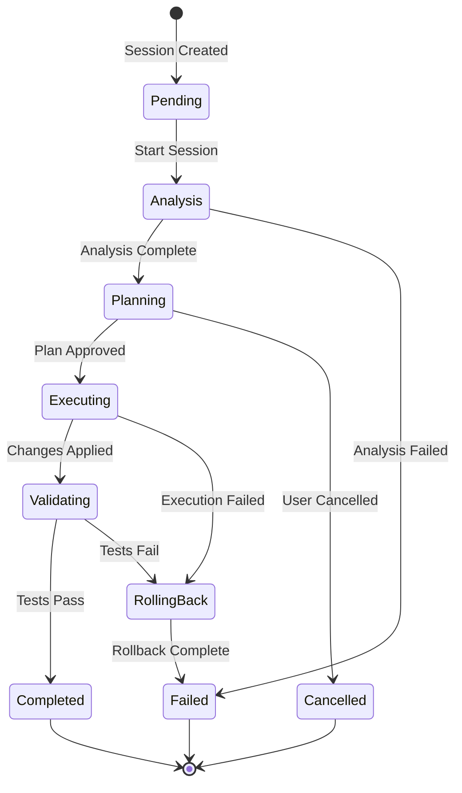
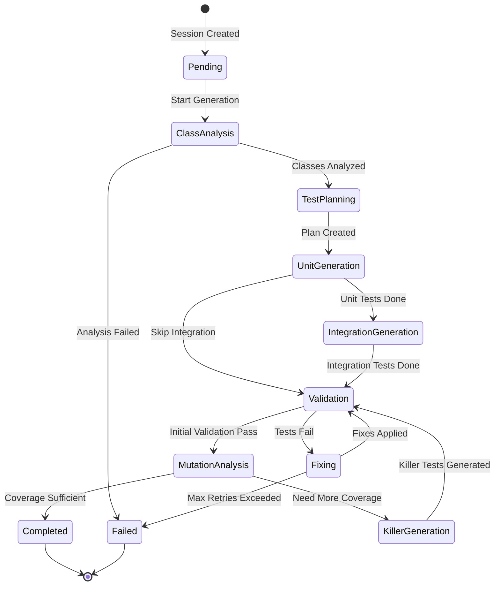
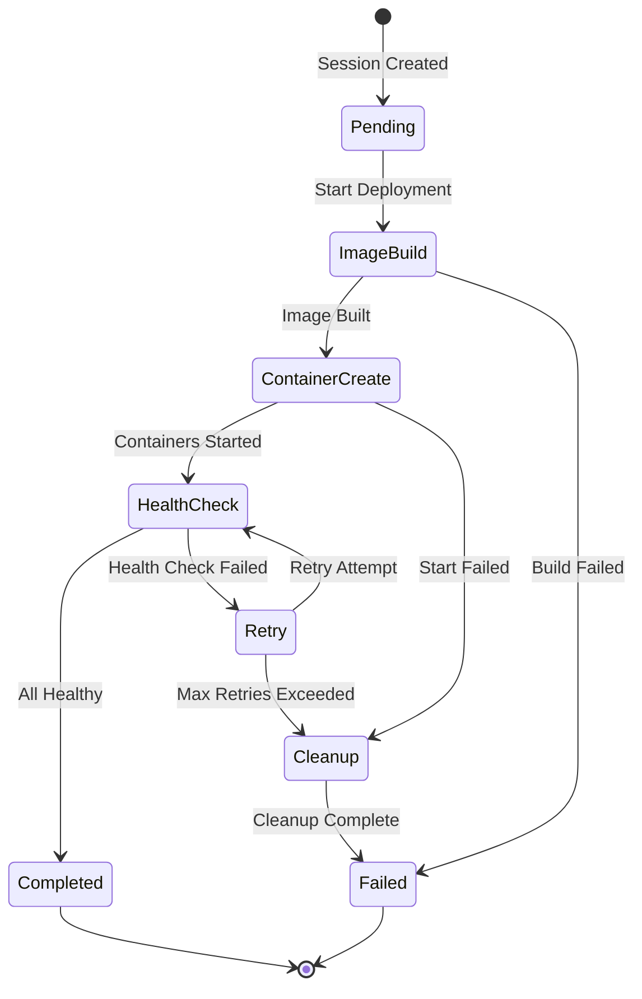
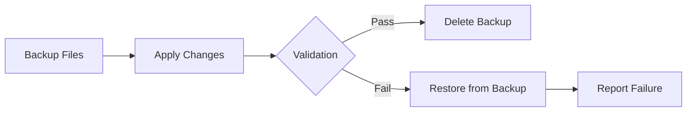
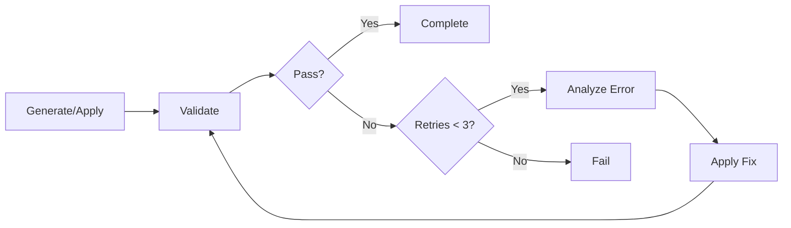
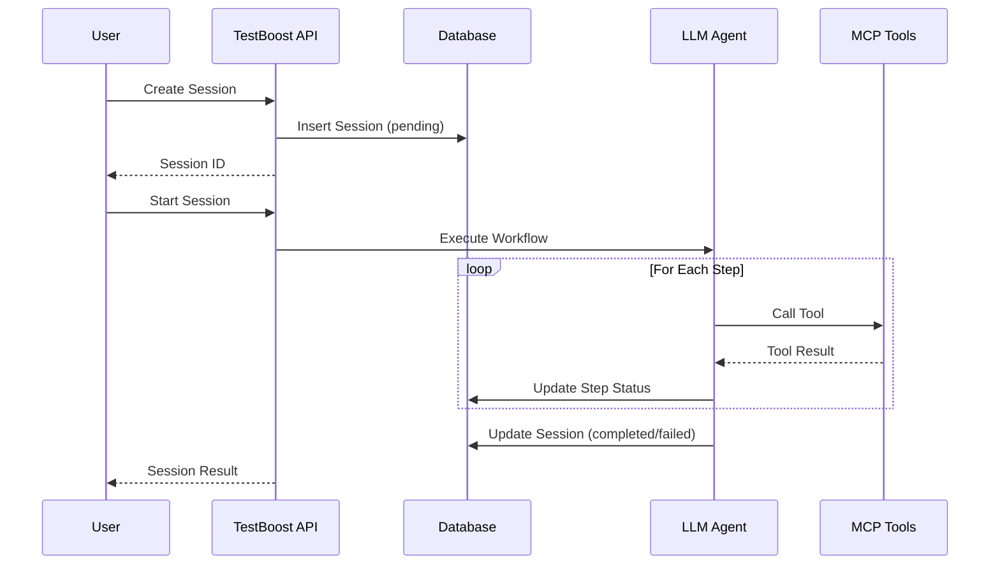

# Workflow Diagrams

**Purpose**: Visual representation of TestBoost workflow state transitions
**Version**: 1.0.0

---

## Maven Maintenance Workflow

### State Descriptions

| State | Description | Exit Criteria |
|-------|-------------|---------------|
| Pending | Session created, awaiting start | User triggers start |
| Analysis | Analyzing project structure and dependencies | Analysis completes or fails |
| Planning | Generating maintenance plan | User approves or rejects |
| Executing | Applying changes (pom updates, code changes) | All changes applied or error |
| Validating | Running tests to validate changes | Tests pass or fail |
| RollingBack | Reverting changes on failure | Rollback completes |
| Completed | Workflow finished successfully | - |
| Failed | Workflow failed with error | - |
| Cancelled | User cancelled workflow | - |

### Transition Conditions

| From | To | Condition |
|------|-----|-----------|
| Analysis | Planning | All dependencies analyzed, no blocking issues |
| Analysis | Failed | Cannot parse pom.xml, invalid project structure |
| Planning | Executing | User approves plan (interactive) or auto-approve (autonomous) |
| Planning | Cancelled | User explicitly cancels |
| Executing | Validating | All planned changes successfully applied |
| Executing | RollingBack | Any change fails to apply |
| Validating | Completed | `mvn test` passes |
| Validating | RollingBack | Tests fail after max 3 retry attempts |

---

## Test Generation Workflow

### State Descriptions

| State | Description | Exit Criteria |
|-------|-------------|---------------|
| Pending | Session created | Start triggered |
| ClassAnalysis | Analyzing target class complexity | Analysis complete |
| TestPlanning | Planning test strategy based on analysis | Plan generated |
| UnitGeneration | Generating unit tests | Tests written |
| IntegrationGeneration | Generating integration tests | Tests written |
| Validation | Running generated tests | Tests pass/fail |
| Fixing | Auto-correcting failed tests | Fixed or max retries |
| MutationAnalysis | Running PIT mutation analysis | Coverage calculated |
| KillerGeneration | Generating killer tests for surviving mutants | Tests generated |
| Completed | All tests generated and passing | - |
| Failed | Generation failed | - |

### Decision Points

1. **Skip Integration Tests**: When class has no external dependencies
2. **Need More Coverage**: Mutation score < 80% threshold
3. **Max Retries Exceeded**: 3 consecutive fix attempts failed

---

## Docker Deployment Workflow

### State Descriptions

| State | Description | Exit Criteria |
|-------|-------------|---------------|
| Pending | Session created | Start triggered |
| ImageBuild | Building Docker images | Images built successfully |
| ContainerCreate | Starting containers via docker-compose | Containers running |
| HealthCheck | Checking container health endpoints | Health passes |
| Retry | Waiting before retry | Timer expires |
| Cleanup | Stopping and removing failed containers | Containers removed |
| Completed | All containers healthy | - |
| Failed | Deployment failed | - |

### Retry Policy

- **Max retries**: 3 attempts
- **Backoff**: Exponential (1s, 2s, 4s)
- **Health check interval**: 5s
- **Health check timeout**: 30s per container

---

## Common Patterns

### Rollback Strategy

All workflows that modify files implement rollback:

### Auto-Correction Loop

For test generation and maintenance:

---

## Session Lifecycle

