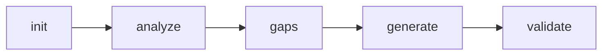

# Workflow

TestBoost follows a five-step sequential workflow. Each step builds on the output of the previous one.

## 1. Init

**Command:** `python -m testboost_lite init <project_path>`

Creates the `.testboost/` directory structure in your Java project and starts a new session.

**What it does:**
- Verifies the project path exists
- Creates `.testboost/config.yaml` with default settings
- Creates a numbered session directory (e.g. `001-test-generation/`)
- Writes `spec.md` with the session intent and progress table

**Output:** `.testboost/sessions/001-test-generation/spec.md`

**Integrity token:** An HMAC-SHA256 token is emitted at the end of every successful step (including `init`). The slash commands instruct the LLM to verify the token is present before proceeding. See [Architecture](./architecture.md) for details.

## 2. Analyze

**Command:** `python -m testboost_lite analyze <project_path>`

Scans the Java project to understand its structure, frameworks, and testing conventions.

**What it does:**
- Parses `pom.xml` (or `build.gradle`) for build configuration and dependencies
- Detects frameworks: Spring Boot, JPA, etc.
- Identifies Java version and project type
- Finds all testable source files (services, controllers, repositories, utilities)
- Detects existing test conventions: naming patterns, assertion styles, mocking frameworks

**Output:** `.testboost/sessions/<id>/analysis.md`

The analysis report includes:
- Project type and build system
- Detected application and testing frameworks
- Source file count and package structure
- List of all testable source files
- Detected conventions (naming, assertions, mocking)

**Core functions used:**
- `analyze_project_context()` from `src/mcp_servers/test_generator/tools/analyze.py`
- `detect_test_conventions()` from `src/mcp_servers/test_generator/tools/conventions.py`
- `find_source_files()` from `src/workflows/test_generation_agent.py`

## 3. Gaps

**Command:** `python -m testboost_lite gaps <project_path>`

Identifies which source files are missing test coverage.

**What it does:**
- Reads the source file list from the analysis step
- Scans `src/test/java/` for existing `*Test.java` and `*Tests.java` files
- Matches source files to test files by name (e.g. `UserService.java` -> `UserServiceTest.java`)
- Assigns priority: services and controllers are **high**, others are **medium**

**Output:** `.testboost/sessions/<id>/coverage-gaps.md`

The gaps report includes:
- Total testable files, files with tests, files without tests
- Estimated coverage percentage
- Prioritized table of files needing tests
- List of already-covered files

## 4. Generate

**Command:** `python -m testboost_lite generate <project_path>`

Generates unit tests for files identified as lacking coverage.

**What it does:**
- Reads the gap list and analysis conventions from previous steps
- For each source file, calls the LLM to generate a test class
- Passes project conventions (naming, assertions, mocking) to the LLM prompt
- Writes generated test files directly to `src/test/java/...` in the project

**Options:**
- `--files ServiceA.java ServiceB.java` -- Generate tests only for specific files
- `--no-llm` -- Use template-based generation (faster, lower quality)
- `--verbose` / `-v` -- Show detailed output

**Output:** `.testboost/sessions/<id>/generation.md` + test files on disk

The generation report includes:
- Number of target files and generated tests
- Table mapping source files to generated test files
- Test method counts per file

**Core function used:**
- `generate_adaptive_tests()` from `src/mcp_servers/test_generator/tools/generate_unit.py`

The LLM prompt includes:
- Class information (name, type, package, methods, dependencies)
- Project conventions detected in the analysis step
- JUnit 5 / Mockito best practices
- Class-type-specific patterns (controller, service, repository)
- Mutation-resistant testing patterns

See [Prompts](./prompts.md) for details on the LLM prompts.

## 5. Validate

**Command:** `python -m testboost_lite validate <project_path>`

Compiles and runs the generated tests using Maven.

**What it does:**
1. Runs `mvn test-compile` to check for compilation errors
2. If compilation fails, parses errors using `MavenErrorParser` and presents them
3. If compilation succeeds, runs `mvn test`
4. Reports test results (passed/failed/skipped)

**Output:** `.testboost/sessions/<id>/validation.md`

When tests fail, the LLM CLI sees the errors and can help you fix them interactively. This is by design: rather than silently auto-correcting, TestBoost shows you what went wrong so you can decide how to proceed.

**Core function used:**
- `MavenErrorParser` from `src/lib/maven_error_parser.py`

## 6. Status (Auxiliary)

**Command:** `python -m testboost_lite status <project_path>`

Displays the current session progress. Shows which steps are completed, in progress, or pending.

## Install (Setup)

**Command:** `python -m testboost_lite install <project_path>`

Installs TestBoost slash commands and wrapper scripts into a target Java project so that you can run TestBoost from your Java project directory. See [Getting Started](./getting-started.md#installing-testboost-in-your-java-project) for details.

## Interactive Workflow with LLM CLI

When using TestBoost through an LLM CLI (Claude Code, OpenCode), the workflow becomes interactive:

1. The slash command tells the LLM what to do
2. The LLM runs the shell script and reads the output
3. The LLM presents the results to you in a readable format
4. You decide whether to proceed, adjust settings, or fix issues
5. The LLM suggests the next step

This interactive loop is particularly valuable at the **generate** and **validate** steps, where you can review generated tests, ask for modifications, and iterate on failures with the LLM's help.
