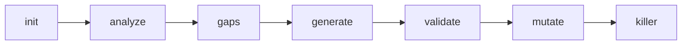

# Workflow

TestBoost follows a sequential workflow. Each step builds on the output of the previous one.

## 1. Init

**Command:** `python -m src.lib.cli init <project_path> [--tech <identifier>]`

Creates the `.testboost/` directory structure in your project and starts a new session.

**What it does:**
- Verifies the project path exists
- **Auto-detects** the project technology using the plugin registry (checks for `pom.xml`, `pyproject.toml`, `go.mod`, etc.)
- If `--tech <identifier>` is provided, uses that plugin directly instead of auto-detecting
- Prints a notice if multiple technologies are detected (e.g. both `pom.xml` and `pyproject.toml`)
- Creates `.testboost/config.yaml` with default settings
- Creates a numbered session directory (e.g. `001-test-generation/`)
- Writes `spec.md` with the session intent, progress table, and `technology` field
- Emits an HMAC-SHA256 integrity token

**Output:** `.testboost/sessions/001-test-generation/spec.md`

**Listing available plugins:** `python -m src.lib.cli --list-plugins`

## 2. Analyze

**Command:** `python -m src.lib.cli analyze <project_path>`

Scans the project to understand its structure, frameworks, and testing conventions.

**What it does:**
- Detects the project technology via `registry.detect()` (replaces hardcoded `pom.xml`/`build.gradle` checks)
- Parses build files for configuration and dependencies
- Detects frameworks (Spring Boot, JPA, pytest, etc.)
- Finds all testable source files via `plugin.find_source_files()`
- Detects existing test conventions using `plugin.test_file_pattern()` for test file discovery
- Builds a **full class index** for every source file (Java: fields with exact types, methods, annotations, hierarchy)
- Extracts representative test examples for LLM style reference

**Output:**
- `.testboost/analysis.md` -- project-level class index, test examples, conventions (shared across sessions)
- `.testboost/sessions/<id>/analysis.md` -- lightweight command overrides for this session

**Core functions used:**
- `analyze_project_context()` from `src/test_generation/analyze.py`
- `detect_test_conventions()` from `src/test_generation/conventions.py`
- `find_source_files()` from `src/lib/bridge.py` (routed through plugin)
- `build_class_index()` from `src/java/class_analyzer.py`
- `extract_test_examples()` from `src/java/class_analyzer.py`

## 3. Gaps

**Command:** `python -m src.lib.cli gaps <project_path>`

Identifies which source files are missing test coverage.

**What it does:**
- Reads the source file list from the analysis step
- Scans for existing test files using technology-appropriate patterns
- Matches source files to test files by name
- Assigns priority: services and controllers are **high**, others are **medium**

**Output:** `.testboost/sessions/<id>/coverage-gaps.md`

## 4. Generate

**Command:** `python -m src.lib.cli generate <project_path> [--files file1 file2]`

Generates unit tests for files identified as lacking coverage.

**What it does:**
- Reads the gap list and analysis conventions from previous steps
- For each source file, calls the LLM to generate a test class
- Uses the plugin's `prompt_template_dir` to load technology-specific prompts (Java prompts for Java projects, pytest prompts for Python projects)
- Passes project conventions (naming, assertions, mocking) to the LLM prompt
- Writes generated test files to the project
- Runs compile-and-fix loop: compiles tests, sends errors to LLM for fixing, retries up to 3 times

**Output:** `.testboost/sessions/<id>/generation.md` + test files on disk

**Core function used:**
- `generate_adaptive_tests()` from `src/test_generation/generate_unit.py`

The LLM prompt includes:
- Class information (name, type, package, methods, dependencies)
- **Full dependency signatures** from the class index (exact field types, all public methods)
- **Inheritance context** -- if the tested class extends another class in the index
- **Multiple test examples** from the project (up to 3 real files)
- Project conventions detected in the analysis step
- Technology-specific best practices (JUnit 5/Mockito for Java, pytest/unittest.mock for Python)
- Class-type-specific patterns (controller, service, repository)

## 5. Validate

**Command:** `python -m src.lib.cli validate <project_path>`

Compiles and runs the generated tests using the plugin's build commands.

**What it does:**
1. Resolves the technology plugin for the current session
2. Runs `plugin.validation_command()` (e.g. `mvn test-compile` for Java, `py_compile` for Python)
3. If compilation fails, parses errors and presents them
4. If compilation succeeds, runs `plugin.test_run_command()` (e.g. `mvn test` for Java, `pytest` for Python)
5. Reports test results (passed/failed/skipped)

**Output:** `.testboost/sessions/<id>/validation.md`

## 6. Mutate

**Command:** `python -m src.lib.cli mutate <project_path> [--min-score 80]`

Runs PIT mutation testing to measure test quality (Java only).

**What it does:**
- Runs PIT mutation testing via Maven
- Analyzes mutation results: killed vs. surviving mutants
- Identifies hard-to-kill mutant patterns
- Provides priority improvement recommendations

**Output:** `.testboost/sessions/<id>/mutation.md`

## 7. Killer

**Command:** `python -m src.lib.cli killer <project_path> [--max-tests 10]`

Generates targeted tests to kill surviving mutants.

**What it does:**
- Reads surviving mutants from the mutation step
- Generates killer tests via LLM
- Runs compile-and-fix loop on generated tests

**Output:** `.testboost/sessions/<id>/killer-tests.md` + test files on disk

## 8. Status (Auxiliary)

**Command:** `python -m src.lib.cli status <project_path>`

Displays the current session progress including the detected **technology** plugin. Shows which steps are completed, in progress, or pending.

## 9. Install (Setup)

**Command:** `python -m src.lib.cli install <project_path>`

Installs TestBoost slash commands and wrapper scripts into a target project so that you can run TestBoost from your project directory. See [Getting Started](./getting-started.md) for details.

## 10. Verify (Auxiliary)

**Command:** `python -m src.lib.cli verify <project_path> <token>`

Verifies an HMAC integrity token emitted at the end of a CLI step.

## Interactive Workflow with LLM CLI

When using TestBoost through an LLM CLI (Claude Code, OpenCode), the workflow becomes interactive:

1. The slash command tells the LLM what to do
2. The LLM runs the shell script and reads the output
3. The LLM presents the results to you in a readable format
4. You decide whether to proceed, adjust settings, or fix issues
5. The LLM suggests the next step

This interactive loop is particularly valuable at the **generate** and **validate** steps, where you can review generated tests, ask for modifications, and iterate on failures with the LLM's help.
