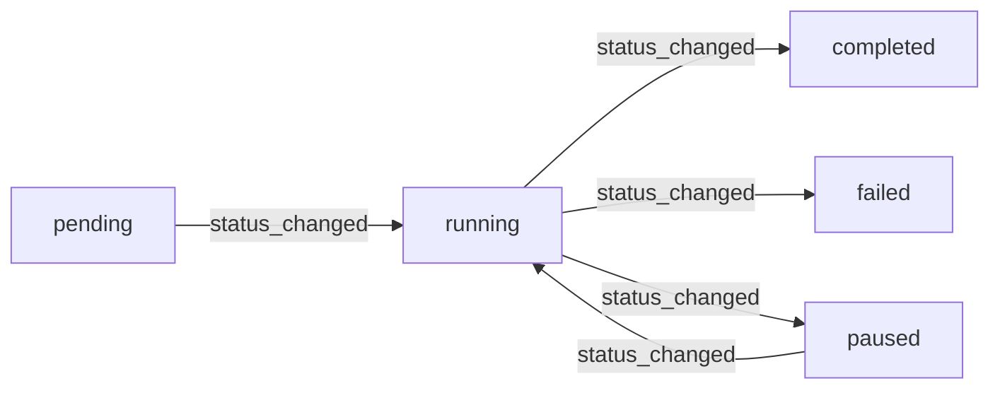
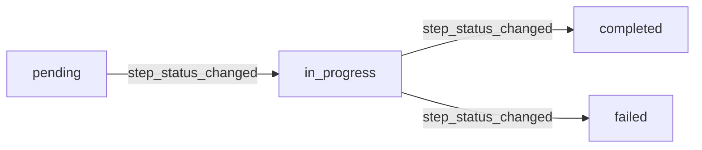

# Data Model: Session Events API

**Feature**: 007-session-events-api
**Date**: 2026-01-13

## Entity: Event

### Database Schema

**Table**: `events`
**Location**: `src/db/models/event.py`

```python
class Event(Base):
    """Event model for tracking all workflow events."""

    __tablename__ = "events"

    # Primary Key
    id: Mapped[uuid.UUID]                    # Unique event identifier

    # Foreign Keys
    session_id: Mapped[uuid.UUID]            # Parent session (CASCADE delete)
    step_id: Mapped[uuid.UUID | None]        # Optional parent step (CASCADE delete)

    # Event Data
    event_type: Mapped[str]                  # Event classification (max 100 chars)
    event_data: Mapped[dict[str, Any]]       # Structured payload (JSONB)
    message: Mapped[str | None]              # Human-readable description (TEXT)
    timestamp: Mapped[datetime]              # When event occurred (timezone-aware)
```

### Field Definitions

| Field | Type | Nullable | Default | Description |
|-------|------|----------|---------|-------------|
| `id` | UUID | No | `uuid.uuid4()` | Unique identifier for the event |
| `session_id` | UUID | No | - | Foreign key to sessions table (CASCADE on delete) |
| `step_id` | UUID | Yes | NULL | Optional foreign key to steps table (CASCADE on delete) |
| `event_type` | VARCHAR(100) | No | - | Event classification (e.g., "workflow_started", "step_completed") |
| `event_data` | JSONB | No | `{}` | Structured event payload with context-specific data |
| `message` | TEXT | Yes | NULL | Human-readable event description for logging/display |
| `timestamp` | TIMESTAMPTZ | No | `utcnow()` | When the event occurred (UTC timezone) |

### Database Indexes

```sql
-- Primary key index (automatic)
PRIMARY KEY (id)

-- Foreign key indexes for joins and cascades
CREATE INDEX ix_events_session_id ON events(session_id);
CREATE INDEX ix_events_step_id ON events(step_id);

-- Query optimization indexes
CREATE INDEX ix_events_event_type ON events(event_type);
CREATE INDEX ix_events_timestamp ON events(timestamp);

-- Optional: Composite index for optimal pagination performance
CREATE INDEX ix_events_session_timestamp ON events(session_id, timestamp DESC);
```

**Index Usage**:
- `ix_events_session_id`: Session-level event queries (all events for a session)
- `ix_events_timestamp`: Ordering events by occurrence time
- `ix_events_event_type`: Filtering by event classification
- `ix_events_session_timestamp` (optional): Optimizes common query pattern (session + timestamp ordering)

### Constraints

**Foreign Key Constraints**:
```sql
FOREIGN KEY (session_id) REFERENCES sessions(id) ON DELETE CASCADE
FOREIGN KEY (step_id) REFERENCES steps(id) ON DELETE CASCADE
```

**Validation Rules**:
- `event_type`: Must match pattern `^[a-z_]+$` (lowercase letters and underscores)
- `event_type`: Maximum length 100 characters
- `timestamp`: Must be timezone-aware (UTC recommended)
- `event_data`: Valid JSON structure (enforced by PostgreSQL JSONB type)

### Relationships

```python
# Relationships defined in Event model
session: Mapped["Session"] = relationship("Session", back_populates="events")
step: Mapped["Step | None"] = relationship("Step", back_populates="events")
```

**Cardinality**:
- One Session → Many Events (1:N)
- One Step → Many Events (1:N)
- One Event → One Session (N:1)
- One Event → Zero or One Step (N:0..1)

**Cascade Behavior**:
- Delete session → All events for that session are deleted
- Delete step → All events for that step are deleted (step_id set to NULL if soft delete)

---

## API Response Model

### EventResponse Schema

**Location**: `src/api/models/__init__.py` (or create in `src/api/routers/sessions.py`)

```python
class EventResponse(BaseModel):
    """API response schema for a single event."""

    id: uuid.UUID = Field(..., description="Unique event identifier")
    session_id: uuid.UUID = Field(..., description="Parent session ID")
    step_id: uuid.UUID | None = Field(None, description="Parent step ID (if event relates to a step)")
    event_type: str = Field(..., description="Event classification", example="workflow_started")
    event_data: dict[str, Any] = Field(..., description="Structured event payload")
    message: str | None = Field(None, description="Human-readable event description")
    timestamp: datetime = Field(..., description="When the event occurred (ISO 8601)")

    model_config = {"from_attributes": True}  # Allow ORM model conversion
```

### EventListResponse Schema

```python
class EventListResponse(BaseModel):
    """API response for paginated event list."""

    items: list[EventResponse] = Field(..., description="List of events for current page")
    pagination: PaginationMeta = Field(..., description="Pagination metadata")
```

### PaginationMeta Schema

```python
class PaginationMeta(BaseModel):
    """Pagination metadata included in list responses."""

    page: int = Field(..., description="Current page number (1-indexed)")
    per_page: int = Field(..., description="Items per page")
    total: int = Field(..., description="Total number of matching events")
    total_pages: int = Field(..., description="Total number of pages")
    has_next: bool = Field(..., description="Whether there is a next page")
    has_prev: bool = Field(..., description="Whether there is a previous page")
```

---

## Event Type Taxonomy

### Standard Event Types

| Event Type | Description | event_data Schema | Example Usage |
|------------|-------------|-------------------|---------------|
| `session_created` | New session initialized | `{"session_type": str, "mode": str}` | Session creation |
| `status_changed` | Session status transition | `{"old_status": str, "new_status": str}` | Status updates |
| `step_created` | New workflow step created | `{"step_code": str, "step_name": str}` | Step initialization |
| `step_status_changed` | Step execution status changed | `{"step_code": str, "old_status": str, "new_status": str}` | Step progress |
| `artifact_created` | New artifact generated | `{"artifact_id": UUID, "artifact_type": str}` | Artifact tracking |
| `workflow_started` | Workflow execution began | `{"workflow_type": str}` | Workflow lifecycle |
| `workflow_resumed` | Paused workflow resumed | `{"checkpoint_id": str}` | Resume from pause |
| `workflow_paused` | Workflow paused | `{"checkpoint_id": str, "reason": str}` | Checkpoint save |
| `workflow_completed` | Workflow succeeded | `{"duration_seconds": float, "result": dict}` | Success outcome |
| `workflow_failed` | Workflow failed | `{"error": str, "error_type": str}` | Failure outcome |
| `workflow_error` | Workflow encountered error | `{"error": str, "recoverable": bool}` | Error handling |

### event_data Structure Guidelines

**General Principles**:
- Use flat structure when possible (avoid deep nesting)
- Include all context needed to understand the event independently
- Use consistent key names across event types
- Include timestamps for duration calculations (start_time, end_time)
- Include identifiers for related entities (step_code, artifact_id, etc.)

**Common Fields**:
```json
{
  "duration_seconds": 12.34,        // For timed operations
  "old_status": "running",          // For state transitions
  "new_status": "completed",
  "error": "Connection timeout",    // For errors
  "error_type": "NetworkError",
  "success": true,                  // For boolean outcomes
  "count": 42,                      // For metrics
  "reason": "User requested"        // For explanatory context
}
```

**Example: workflow_completed Event**:
```json
{
  "id": "a1b2c3d4-e5f6-7890-abcd-ef1234567890",
  "session_id": "12345678-1234-1234-1234-123456789012",
  "step_id": null,
  "event_type": "workflow_completed",
  "event_data": {
    "workflow_type": "test_generation",
    "duration_seconds": 45.67,
    "tests_generated": 12,
    "success": true
  },
  "message": "Test generation workflow completed successfully. Generated 12 tests in 45.67 seconds.",
  "timestamp": "2026-01-13T14:30:00.123456Z"
}
```

---

## Query Patterns

### Primary Query: Get Paginated Events

**Use Case**: Frontend polls for events to display in UI

```sql
SELECT *
FROM events
WHERE session_id = $1
  AND ($2::text IS NULL OR event_type = $2)
  AND ($3::timestamptz IS NULL OR timestamp > $3)
ORDER BY timestamp DESC
LIMIT $4 OFFSET $5;
```

**Parameters**:
- `$1`: session_id (UUID)
- `$2`: event_type filter (nullable)
- `$3`: since timestamp filter (nullable)
- `$4`: limit (per_page)
- `$5`: offset (calculated from page number)

**Index Usage**: Uses `ix_events_session_timestamp` (if available) or `ix_events_session_id` + sort

**Expected Performance**: < 100ms for typical event volumes (up to 10,000 events per session)

### Count Query: Get Total Matching Events

**Use Case**: Calculate pagination metadata (total_pages, has_next)

```sql
SELECT COUNT(*)
FROM events
WHERE session_id = $1
  AND ($2::text IS NULL OR event_type = $2)
  AND ($3::timestamptz IS NULL OR timestamp > $3);
```

**Optimization**: Count query should use the same indexes as the main query

---

## State Transitions

### Session Status Events



**Events Emitted**:
- `pending → running`: status_changed event with old_status="pending", new_status="running"
- `running → completed`: status_changed + workflow_completed
- `running → failed`: status_changed + workflow_failed
- `running → paused`: status_changed + workflow_paused
- `paused → running`: status_changed + workflow_resumed

### Step Status Events



**Events Emitted**:
- Step creation: step_created
- `pending → in_progress`: step_status_changed
- `in_progress → completed`: step_status_changed
- `in_progress → failed`: step_status_changed

---

## Data Retention

**Policy**: Events are immutable and retained for the lifetime of the session

**Cascade Deletion**:
- When session is deleted → All events are deleted (ON DELETE CASCADE)
- When step is deleted → Events retain step_id or it's set to NULL (depends on implementation)

**Archival** (Future Consideration):
- Move events older than 90 days to cold storage
- Maintain event_id references for audit trail

---

## Example Event Sequences

### Test Generation Workflow

```json
[
  {
    "event_type": "session_created",
    "timestamp": "2026-01-13T14:00:00Z",
    "message": "Created test_generation session for project test-projects/java-maven"
  },
  {
    "event_type": "workflow_started",
    "timestamp": "2026-01-13T14:00:01Z",
    "message": "Starting test generation workflow"
  },
  {
    "event_type": "step_created",
    "timestamp": "2026-01-13T14:00:01Z",
    "message": "Created step: analyze_project"
  },
  {
    "event_type": "step_status_changed",
    "timestamp": "2026-01-13T14:00:02Z",
    "message": "Step analyze_project: pending → in_progress"
  },
  {
    "event_type": "step_status_changed",
    "timestamp": "2026-01-13T14:00:15Z",
    "message": "Step analyze_project: in_progress → completed"
  },
  {
    "event_type": "artifact_created",
    "timestamp": "2026-01-13T14:00:15Z",
    "message": "Created artifact: HelloWorldTest.java"
  },
  {
    "event_type": "workflow_completed",
    "timestamp": "2026-01-13T14:00:45Z",
    "message": "Test generation workflow completed. Generated 12 tests in 44 seconds."
  }
]
```

### Error Scenario

```json
[
  {
    "event_type": "workflow_started",
    "timestamp": "2026-01-13T14:00:00Z"
  },
  {
    "event_type": "workflow_error",
    "timestamp": "2026-01-13T14:00:10Z",
    "message": "LLM API rate limit exceeded",
    "event_data": {
      "error": "Rate limit exceeded: 429 Too Many Requests",
      "error_type": "LLMRateLimitError",
      "recoverable": true,
      "retry_after": 60
    }
  },
  {
    "event_type": "workflow_failed",
    "timestamp": "2026-01-13T14:00:10Z",
    "message": "Workflow failed after 3 retry attempts",
    "event_data": {
      "error": "Maximum retries exceeded",
      "retry_count": 3
    }
  }
]
```

---

## Migration Notes

**Database Migration**: None required - events table already exists with all necessary fields and indexes.

**Schema Version**: Existing schema (from migration `602dd0971fff_initial_schema.py`)

**Backward Compatibility**: API is new, no backward compatibility concerns. All changes are additive.
