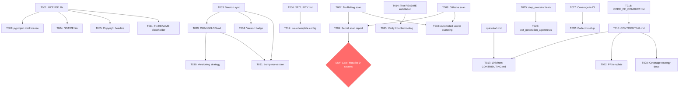

# Implementation Tasks: Open Source Release Preparation

**Branch**: `008-opensource-release` | **Date**: 2026-01-26 | **Feature**: [spec.md](spec.md)

**Input**: Design documents from Phase 0 (research.md) and Phase 1 (quickstart.md)

**Note**: This file is generated by `/speckit.tasks` command. Tasks are organized by user story to enable independent testing.

---

## Table of Contents

1. [Task Overview](#task-overview)
2. [User Story 1: External Developer Onboarding (P1)](#user-story-1-external-developer-onboarding-p1)
3. [User Story 2: External Contributor Engagement (P2)](#user-story-2-external-contributor-engagement-p2)
4. [User Story 3: Project Evaluation and Adoption (P3)](#user-story-3-project-evaluation-and-adoption-p3)
5. [MVP Scope](#mvp-scope)
6. [Task Dependencies](#task-dependencies)
7. [Parallel Execution Groups](#parallel-execution-groups)
8. [Testing & Validation](#testing--validation)

---

## Task Overview

### Summary Statistics

| Category | Count | Total Effort | Status |
|----------|-------|--------------|--------|
| P1 Tasks (Critical) | 15 | ~25 hours | ⏳ Not Started |
| P2 Tasks (Important) | 13 | ~30 hours | ⏳ Not Started |
| P3 Tasks (Nice-to-have) | 8 | ~10 hours | ⏳ Not Started |
| **Total** | **36** | **~65 hours** | ⏳ Not Started |

**Note**: Test coverage expansion (T024-T028) requires additional 255-859 hours depending on target (51%, 70%, or 80% coverage). This is tracked separately as it can proceed in parallel with documentation tasks.

### Progress Tracking

- [ ] **User Story 1 Complete** (0/15 tasks) - External Developer Onboarding
- [ ] **User Story 2 Complete** (0/13 tasks) - External Contributor Engagement
- [ ] **User Story 3 Complete** (0/8 tasks) - Project Evaluation and Adoption
- [ ] **MVP Ready** (0/15 tasks) - Minimum viable public release
- [ ] **Full Release Ready** (0/36 tasks) - All features complete

---

## User Story 1: External Developer Onboarding (P1)

**Goal**: Enable new developers to install, run, and evaluate TestBoost in <30 minutes using only documentation

**Acceptance Criteria**:
- 5 external developers can complete installation in <30 minutes
- README comprehension: 90% understand purpose within 2 minutes
- Quick start example produces working output within 5 minutes
- Troubleshooting documentation covers common issues

### Legal and Licensing (TG1)

- [X] **T001** [P1] [US1] Create Apache 2.0 LICENSE file at repository root
  - **File**: [LICENSE](../../LICENSE)
  - **Input**: Apache 2.0 license text from https://www.apache.org/licenses/LICENSE-2.0.txt
  - **Validation**: File contains standard Apache 2.0 text with copyright year 2026 and project name TestBoost
  - **Effort**: 15 minutes
  - **Dependencies**: None (can start immediately)

- [X] **T002** [P1] [US1] Update pyproject.toml with license field
  - **File**: [pyproject.toml](../../pyproject.toml)
  - **Change**: Add `license = "Apache-2.0"` under `[tool.poetry]` section
  - **Validation**: `poetry check` passes, license field correctly formatted
  - **Effort**: 5 minutes
  - **Dependencies**: T001 (license file must exist first)

- [X] **T003** [P1] [US1] Fix version mismatch: sync to v0.2.0 across all files
  - **Files**:
    - [pyproject.toml](../../pyproject.toml) - Change `version = "0.1.0"` to `version = "0.2.0"`
    - [README.md](../../README.md) - Verify shows v0.2.0 (already correct per research)
  - **Validation**: `grep -r "0.1.0" .` returns no results in project metadata files
  - **Effort**: 10 minutes
  - **Dependencies**: None (can run in parallel with T001)

- [X] **T004** [P1] [US1] Create NOTICE file with copyright attributions
  - **File**: [NOTICE](../../NOTICE)
  - **Content**: TestBoost copyright + any required third-party attributions
  - **Template**:
    ```
    TestBoost
    Copyright 2026 [Maintainer Names]

    This product includes software developed by [list any required attributions]
    ```
  - **Validation**: File exists with correct format
  - **Effort**: 20 minutes
  - **Dependencies**: T001 (to reference license)

- [X] **T005** [P1] [US1] Add copyright headers to source files (top 10 most critical)
  - **Files**: Add SPDX header to:
    - src/api/main.py
    - src/core/session.py
    - src/core/step_executor.py
    - src/workflows/test_generation_agent.py
    - src/workflows/maven_maintenance_agent.py
    - src/db/models/__init__.py
    - src/lib/llm.py
    - src/lib/logging.py
    - src/mcp_servers/test_generator/server.py
    - src/cli/main.py
  - **Header Format**:
    ```python
    # SPDX-License-Identifier: Apache-2.0
    # Copyright 2026 TestBoost Contributors
    ```
  - **Validation**: Each file starts with SPDX header
  - **Effort**: 30 minutes
  - **Dependencies**: T001 (license must be chosen)

### Security and Privacy (TG2 - Critical)

- [X] **T006** [P1] [US1] Create SECURITY.md with vulnerability reporting process
  - **File**: [SECURITY.md](../../SECURITY.md)
  - **Template**: OpenSSF + FastAPI model (from research.md R3)
  - **Sections**:
    - Supported versions table
    - Reporting process (DO NOT use public issues)
    - Dedicated security email
    - Response timelines (48h acknowledgment, 5-day updates)
    - Responsible disclosure request
  - **Validation**: File covers all required sections from FR-012
  - **Effort**: 45 minutes
  - **Dependencies**: None (can run in parallel)

- [X] **T007** [P1] [US1] Run initial secret scan with TruffleHog (entire git history)
  - **Command**: `docker run --rm -v $(pwd):/repo trufflesecurity/trufflehog:latest git file:///repo --only-verified --json > trufflehog-report.json`
  - **Output**: [specs/008-opensource-release/secret-scan-trufflehog.json](secret-scan-trufflehog.json)
  - **Validation**: Generate report showing 0 verified secrets OR documented remediation plan
  - **Effort**: 1 hour (scan + analysis)
  - **Dependencies**: None (can run immediately)

- [X] **T008** [P1] [US1] Run initial secret scan with Gitleaks (entire git history)
  - **Command**: `docker run --rm -v $(pwd):/repo zricethezav/gitleaks:latest detect --source /repo --report-path /repo/gitleaks-report.json`
  - **Output**: [specs/008-opensource-release/secret-scan-gitleaks.json](secret-scan-gitleaks.json)
  - **Validation**: Generate report with findings documented and prioritized
  - **Effort**: 1 hour (scan + analysis)
  - **Dependencies**: None (can run in parallel with T007)

- [X] **T009** [P1] [US1] Document secret scanning findings and create remediation plan (if needed)
  - **File**: [specs/008-opensource-release/secret-scan-report.md](secret-scan-report.md)
  - **Content**:
    - Summary of findings from TruffleHog and Gitleaks
    - Cross-validation (findings detected by both tools = higher priority)
    - False positive analysis (test fixtures, documentation examples)
    - Remediation plan for any true positives
    - Confirmation that .env.example uses placeholder values only
  - **Validation**: Report exists with actionable remediation steps OR confirmation of 0 secrets
  - **Effort**: 1-2 hours (depends on findings)
  - **Dependencies**: T007, T008 (both scans must complete)
  - **Blocker**: MUST be resolved before public release (SC-005)

- [X] **T010** [P1] [US1] Set up automated secret scanning in CI/CD
  - **File**: [.github/workflows/secret-scanning.yml](../../.github/workflows/secret-scanning.yml)
  - **Content**: GitHub Actions workflow running TruffleHog and Gitleaks on every PR and push
  - **Template**: From research.md R1 implementation approach
  - **Validation**: Workflow runs successfully on test PR
  - **Effort**: 45 minutes
  - **Dependencies**: T007, T008 (to validate workflow configuration)

### Documentation Polish (TG6 - Critical for Onboarding)

- [X] **T011** [P1] [US1] Fix README placeholder: Replace "[Your License Here]" with "Apache 2.0"
  - **File**: [README.md](../../README.md:440)
  - **Change**: Line 440 - Replace placeholder with "This project is licensed under the Apache License 2.0 - see the [LICENSE](LICENSE) file for details."
  - **Validation**: No "[Your License Here]" text remains in README
  - **Effort**: 5 minutes
  - **Dependencies**: T001 (LICENSE file must exist to link to)

- [X] **T012** [P1] [US1] Add CI status badge to README
  - **File**: [README.md](../../README.md)
  - **Badge**: ``
  - **Location**: After project title, before description
  - **Validation**: Badge renders correctly on GitHub and links to workflow runs
  - **Effort**: 10 minutes
  - **Dependencies**: None (existing CI workflows already run)

- [X] **T013** [P1] [US1] Add test coverage badge to README (placeholder for now)
  - **File**: [README.md](../../README.md)
  - **Badge**: `` (will update as coverage improves)
  - **Location**: Next to CI badge
  - **Note**: Badge URL will be replaced with real coverage service (Codecov/Coveralls) in T032
  - **Validation**: Badge displays current coverage percentage
  - **Effort**: 10 minutes
  - **Dependencies**: None (can add placeholder immediately)

- [X] **T014** [P1] [US1] Review and test README installation instructions with fresh environment
  - **Process**:
    1. Spin up clean Ubuntu VM or Docker container
    2. Follow installation instructions from README line-by-line
    3. Document any missing steps, unclear instructions, or errors
    4. Update README with fixes
  - **File**: [README.md](../../README.md)
  - **Validation**: External tester can complete installation in <30 minutes (SC-001)
  - **Effort**: 2 hours (testing + fixes)
  - **Dependencies**: None (test current state, then iterate)
  - **Critical**: This validates User Story 1 acceptance scenario #2

- [X] **T015** [P1] [US1] Verify troubleshooting section covers common installation issues
  - **File**: [README.md](../../README.md) - Troubleshooting section
  - **Check**:
    - Database connection errors
    - Missing Python dependencies
    - Port conflicts (5433, 8000)
    - API key configuration issues
    - Docker setup problems
  - **Validation**: At least 5 common issues documented with solutions
  - **Effort**: 30 minutes (review + add missing items)
  - **Dependencies**: T014 (use findings from installation testing)

---

## User Story 2: External Contributor Engagement (P2)

**Goal**: Enable developers to contribute bug fixes and feature enhancements with clear guidance on project standards

**Acceptance Criteria**:
- CONTRIBUTING.md explains development workflow, coding standards, and PR process
- Contributors can set up dev environment and pass all tests locally
- CI/CD provides clear feedback on PR issues
- Review process is transparent with documented criteria

### Community Guidelines (TG3)

- [ ] **T016** [P2] [US2] Create CONTRIBUTING.md with comprehensive contribution guide
  - **File**: [CONTRIBUTING.md](../../CONTRIBUTING.md)
  - **Template**: Based on research.md R3 recommendations
  - **Sections**:
    - Welcome message (warm, inviting tone)
    - Code of Conduct link
    - Getting Started (good first issue labels)
    - Development Setup (reference quickstart.md)
    - How to Contribute (bugs, features, docs)
    - Coding Standards (PEP 8, type hints, ruff configuration)
    - Testing Requirements (coverage expectations, test types)
    - Pull Request Process (fork, branch, commit format, PR template)
    - Review Timeline (48-hour initial response commitment)
    - Getting Help (Discussions, Issues, Email)
  - **Validation**: Document is welcoming, comprehensive, and easy to follow
  - **Effort**: 2 hours
  - **Dependencies**: T018 (to link to CODE_OF_CONDUCT.md), quickstart.md (already exists)

- [ ] **T017** [P2] [US2] Reference quickstart.md from CONTRIBUTING.md
  - **Files**:
    - [CONTRIBUTING.md](../../CONTRIBUTING.md) - Add link in "Development Setup" section
    - [specs/008-opensource-release/quickstart.md](quickstart.md) - Move to docs/ directory for visibility
  - **Change**: Move quickstart.md to [docs/contributor-quickstart.md](../../docs/contributor-quickstart.md)
  - **Update**: Link from CONTRIBUTING.md: "See [Contributor Quickstart](docs/contributor-quickstart.md) for step-by-step setup."
  - **Validation**: Link resolves correctly on GitHub
  - **Effort**: 15 minutes
  - **Dependencies**: T016 (CONTRIBUTING.md must exist)

- [ ] **T018** [P2] [US2] Create CODE_OF_CONDUCT.md using Contributor Covenant 2.1
  - **File**: [CODE_OF_CONDUCT.md](../../CODE_OF_CONDUCT.md)
  - **Template**: Contributor Covenant 2.1 from https://www.contributor-covenant.org/version/2/1/code_of_conduct/
  - **Customization**: Add TestBoost-specific values while keeping core framework
  - **Contact**: Add enforcement email (e.g., conduct@testboost.dev or use maintainer email)
  - **Validation**: File uses standard template with correct contact information
  - **Effort**: 30 minutes
  - **Dependencies**: None (standard template)

- [ ] **T019** [P2] [US2] Create GitHub issue template config (template chooser)
  - **File**: [.github/ISSUE_TEMPLATE/config.yml](../../.github/ISSUE_TEMPLATE/config.yml)
  - **Content**:
    ```yaml
    blank_issues_enabled: false
    contact_links:
      - name: Ask a Question
        url: https://github.com/cheche71/TestBoost/discussions
        about: Please use GitHub Discussions for questions
      - name: Security Vulnerability
        url: https://github.com/cheche71/TestBoost/security/policy
        about: Please report security issues privately (see SECURITY.md)
    ```
  - **Validation**: Template chooser appears when creating new issue on GitHub
  - **Effort**: 15 minutes
  - **Dependencies**: T006 (SECURITY.md must exist to link to)

- [ ] **T020** [P2] [US2] Create bug report issue template (YAML form)
  - **File**: [.github/ISSUE_TEMPLATE/bug_report.yml](../../.github/ISSUE_TEMPLATE/bug_report.yml)
  - **Structure**: YAML form with required fields:
    - Description
    - Steps to reproduce
    - Expected behavior
    - Actual behavior
    - TestBoost version
    - Python version
    - OS/Platform
    - Logs/Screenshots
  - **Validation**: Form renders correctly on GitHub with required field validation
  - **Effort**: 30 minutes
  - **Dependencies**: None (can create independently)

- [ ] **T021** [P2] [US2] Create feature request issue template (YAML form)
  - **File**: [.github/ISSUE_TEMPLATE/feature_request.yml](../../.github/ISSUE_TEMPLATE/feature_request.yml)
  - **Structure**: YAML form with:
    - Problem statement (what problem does this solve?)
    - Proposed solution
    - Alternative solutions considered
    - Additional context
  - **Focus**: Problem statement over implementation details
  - **Validation**: Form encourages users to describe problems, not just request features
  - **Effort**: 25 minutes
  - **Dependencies**: None (can create independently)

- [ ] **T022** [P2] [US2] Create pull request template
  - **File**: [.github/pull_request_template.md](../../.github/pull_request_template.md)
  - **Sections**:
    - Description + issue link (Fixes #123)
    - Type of change (bugfix, feature, docs, refactor, etc.)
    - Testing evidence (commands run, output, coverage)
    - Checklist:
      - [ ] Tests pass locally (`pytest`)
      - [ ] Linting passes (`ruff check .`)
      - [ ] Type checking passes (`mypy src/`)
      - [ ] Documentation updated (if API changes)
      - [ ] Tests added/updated (if applicable)
      - [ ] No new dependencies OR dependencies justified
      - [ ] Breaking changes documented (if applicable)
    - License acknowledgment: "By submitting this PR, I confirm my contribution is made under the Apache 2.0 license."
  - **Validation**: Template appears when creating PR on GitHub
  - **Effort**: 30 minutes
  - **Dependencies**: T016 (to reference CONTRIBUTING.md)

- [ ] **T023** [P2] [US2] Add "good first issue" labels to GitHub repository
  - **Action**: Create labels via GitHub UI or API:
    - `good first issue` (green) - Easy tasks for newcomers
    - `help wanted` (blue) - Community contributions welcome
    - `documentation` (gray) - Documentation improvements
    - `bug` (red) - Bug reports
    - `enhancement` (purple) - Feature requests
    - `question` (yellow) - Questions about usage
  - **Validation**: Labels exist and are used in at least 3 existing issues
  - **Effort**: 20 minutes
  - **Dependencies**: None (GitHub repository management)

### Test Coverage Expansion (TG4 - Supports CI/CD Validation)

**Note**: These tasks can proceed in parallel with documentation tasks and represent significant ongoing effort beyond initial release.

- [ ] **T024** [P2] [US2] Expand test coverage for critical files (Phase 1: 36% → 51%)
  - **Goal**: Cover top 11 worst-covered critical files from research.md R2
  - **Priority Files**:
    1. src/core/step_executor.py (0% → 70%, 25h)
    2. src/workflows/test_generation_agent.py (8% → 70%, 115h)
    3. src/agents/loader.py (20% → 70%, 36h)
    4. src/agents/adapter.py (0% → 70%, 14h)
    5. src/workflows/maven_maintenance_agent.py (10% → 70%, 15h)
    6. src/workflows/docker_deployment_agent.py (15% → 70%, 12h)
    7. src/core/context_manager.py (22% → 70%, 10h)
    8. src/api/routers/sessions.py (45% → 80%, 8h)
    9. src/api/routers/logs.py (50% → 80%, 6h)
    10. src/api/routers/metrics.py (55% → 80%, 5h)
    11. src/lib/llm.py (30% → 70%, 9h)
  - **Total Effort**: 255 hours (6 weeks with 4 developers)
  - **Testing Patterns**: Use patterns from quickstart.md (async fixtures, LLM mocking)
  - **Validation**: `pytest --cov=src --cov-report=term` shows ≥51% coverage
  - **Dependencies**: None (can start immediately)
  - **Note**: This is a LARGE task that should be broken down into sub-tasks per file

- [ ] **T025** [P2] [US2] Create test scenarios for step_executor.py (0% coverage)
  - **File**: [tests/unit/core/test_step_executor.py](../../tests/unit/core/test_step_executor.py)
  - **Scenarios**:
    - Test execute_step() with valid input
    - Test execute_step() with async operations
    - Test error handling for failed steps
    - Test step dependency resolution
    - Test step timeout handling
  - **Estimated Effort**: 25 hours (highest priority, 0% coverage)
  - **Validation**: Coverage for step_executor.py reaches ≥70%
  - **Dependencies**: None (can start immediately)

- [ ] **T026** [P2] [US2] Create integration tests for test_generation_agent workflow (8% coverage)
  - **File**: [tests/integration/workflows/test_test_generation_agent.py](../../tests/integration/workflows/test_test_generation_agent.py)
  - **Approach**: Mock LLM responses using respx
  - **Scenarios**:
    - Test full workflow end-to-end
    - Test with different project types (Maven, Gradle)
    - Test error recovery and retries
    - Test with invalid Java files
  - **Estimated Effort**: 115 hours (most complex workflow)
  - **Validation**: Coverage for test_generation_agent.py reaches ≥70%
  - **Dependencies**: T025 (step_executor tests provide foundation)

- [ ] **T027** [P2] [US2] Add coverage reporting to CI/CD pipeline
  - **File**: [.github/workflows/ci-tests.yml](../../.github/workflows/ci-tests.yml)
  - **Changes**:
    - Add `pytest --cov=src --cov-report=xml --cov-report=term` to test step
    - Upload coverage report to Codecov or Coveralls (free for open source)
    - Add coverage threshold check (fail if <36% to prevent regression)
  - **Validation**: CI job uploads coverage report and displays in PR comments
  - **Effort**: 1 hour
  - **Dependencies**: None (can add immediately with current 36% as baseline)

- [ ] **T028** [P2] [US2] Document test coverage strategy in CONTRIBUTING.md
  - **File**: [CONTRIBUTING.md](../../CONTRIBUTING.md) - Testing section
  - **Content**:
    - Current coverage: 36% (as of 2026-01-26)
    - Target coverage: 80% (long-term goal)
    - Coverage expectations for new code: ≥80% for new features
    - Coverage expectations for bug fixes: Cover the fixed bug path
    - How to run coverage locally: `pytest --cov=src --cov-report=html`
    - Where to find coverage reports: `htmlcov/index.html`
  - **Validation**: Contributors understand coverage expectations
  - **Effort**: 20 minutes
  - **Dependencies**: T016 (CONTRIBUTING.md must exist)

---

## User Story 3: Project Evaluation and Adoption (P3)

**Goal**: Enable technical decision-makers to assess code quality, security, licensing, and active maintenance

**Acceptance Criteria**:
- Project health indicators visible (recent commits, issue response, CI status)
- LICENSE file clearly states terms
- SECURITY.md explains vulnerability handling
- Test coverage and CI badges verify quality standards

### Project Metadata (TG5)

- [ ] **T029** [P3] [US3] Create CHANGELOG.md following Keep a Changelog format
  - **File**: [CHANGELOG.md](../../CHANGELOG.md)
  - **Template**: Keep a Changelog 1.1.0 from https://keepachangelog.com/en/1.1.0/
  - **Initial Content**:
    ```markdown
    # Changelog

    All notable changes to this project will be documented in this file.

    The format is based on [Keep a Changelog](https://keepachangelog.com/en/1.1.0/),
    and this project adheres to [Semantic Versioning](https://semver.org/spec/v2.0.0.html).

    ## [Unreleased]
    ### Added
    - Open source release preparation

    ## [0.2.0] - 2026-01-26
    ### Added
    - Session events API
    - File modifications API
    - Impact analysis testing
    - Test plan documentation
    - DeepAgents integration

    [Unreleased]: https://github.com/cheche71/TestBoost/compare/v0.2.0...HEAD
    [0.2.0]: https://github.com/cheche71/TestBoost/releases/tag/v0.2.0
    ```
  - **Validation**: File follows Keep a Changelog format
  - **Effort**: 45 minutes
  - **Dependencies**: T003 (version must be synced to 0.2.0)

- [ ] **T030** [P3] [US3] Document semantic versioning strategy in CHANGELOG.md
  - **File**: [CHANGELOG.md](../../CHANGELOG.md) - Add section at top or link to docs
  - **Content**: Reference research.md R5 version bump criteria:
    - MAJOR: Breaking changes (API removal, CLI restructure, Python version bump)
    - MINOR: New features (new endpoints, commands, workflows)
    - PATCH: Bug fixes, security patches, performance improvements
  - **Link**: Can create [docs/versioning-strategy.md](../../docs/versioning-strategy.md) with details
  - **Validation**: Versioning criteria documented and linked from CHANGELOG
  - **Effort**: 30 minutes
  - **Dependencies**: T029 (CHANGELOG must exist)

- [ ] **T031** [P3] [US3] Install and configure bump-my-version for version management
  - **Action**:
    ```bash
    poetry add --group dev bump-my-version
    ```
  - **Config**: Create [.bumpversion.toml](../../.bumpversion.toml):
    ```toml
    [tool.bumpversion]
    current_version = "0.2.0"
    parse = "(?P<major>\\d+)\\.(?P<minor>\\d+)\\.(?P<patch>\\d+)"
    serialize = ["{major}.{minor}.{patch}"]
    search = "{current_version}"
    replace = "{new_version}"

    [[tool.bumpversion.files]]
    filename = "pyproject.toml"
    search = 'version = "{current_version}"'
    replace = 'version = "{new_version}"'

    [[tool.bumpversion.files]]
    filename = "CHANGELOG.md"
    search = "## [Unreleased]"
    replace = "## [Unreleased]\n\n## [{new_version}] - {now:%Y-%m-%d}"
    ```
  - **Validation**: `bump-my-version bump patch` successfully bumps version in all files
  - **Effort**: 30 minutes
  - **Dependencies**: T003 (version must be synced first), T029 (CHANGELOG must exist)

- [ ] **T032** [P3] [US3] Set up Codecov or Coveralls for coverage badge
  - **Action**:
    - Sign up for Codecov (https://codecov.io/) or Coveralls (https://coveralls.io/) using GitHub account
    - Add repository to coverage service
    - Generate token for uploads
  - **File**: [.github/workflows/ci-tests.yml](../../.github/workflows/ci-tests.yml)
  - **Changes**:
    - Add coverage upload step: `codecov/codecov-action@v3` or `coverallsapp/github-action@v2`
    - Add token to GitHub Secrets
  - **Update**: [README.md](../../README.md) - Replace placeholder badge with real Codecov/Coveralls badge
  - **Validation**: Badge shows live coverage percentage from CI
  - **Effort**: 45 minutes
  - **Dependencies**: T027 (CI must generate coverage reports)

- [ ] **T033** [P3] [US3] Add repository topics/tags on GitHub for discoverability
  - **Action**: Via GitHub UI (Settings → Topics) or API, add topics:
    - `test-automation`
    - `test-generation`
    - `ai-testing`
    - `llm`
    - `java-testing`
    - `maven`
    - `python`
    - `fastapi`
    - `langgraph`
    - `postgresql`
  - **Validation**: Topics appear on repository homepage and in GitHub search
  - **Effort**: 10 minutes
  - **Dependencies**: None (GitHub repository management)

- [ ] **T034** [P3] [US3] Add version badge to README
  - **File**: [README.md](../../README.md)
  - **Badge**: ``
  - **Location**: Next to CI and coverage badges
  - **Note**: Update manually until auto-versioning with python-semantic-release in post-1.0
  - **Validation**: Badge displays current version
  - **Effort**: 5 minutes
  - **Dependencies**: T003 (version must be synced)

### Third-Party License Documentation (TG5 - Legal Compliance)

- [ ] **T035** [P3] [US3] Generate THIRD_PARTY_LICENSES.md with all dependency licenses
  - **File**: [THIRD_PARTY_LICENSES.md](../../THIRD_PARTY_LICENSES.md)
  - **Command**:
    ```bash
    pip-licenses --format=markdown --with-urls --with-license-file --no-license-path > THIRD_PARTY_LICENSES.md
    ```
  - **Manual Additions**:
    - Header: "TestBoost uses the following third-party open source software"
    - Note about LGPL dependencies (psycopg2-binary uses dynamic linking)
  - **Validation**: All 310 dependencies listed with license types and URLs
  - **Effort**: 30 minutes
  - **Dependencies**: None (depends on current environment)

- [ ] **T036** [P3] [US3] Add license checking to CI/CD pipeline
  - **File**: [.github/workflows/ci.yml](../../.github/workflows/ci.yml)
  - **Add Job**:
    ```yaml
    license-check:
      runs-on: ubuntu-latest
      steps:
        - uses: actions/checkout@v4
        - uses: actions/setup-python@v5
          with:
            python-version: '3.11'
        - run: pip install pip-licenses
        - run: pip-licenses --fail-on="GPL;AGPL" --allow="LGPL"
    ```
  - **Validation**: CI fails if GPL/AGPL dependencies are added
  - **Effort**: 20 minutes
  - **Dependencies**: None (can add immediately)

---

## MVP Scope

**Minimum Viable Public Release**: User Story 1 (P1) Only

MVP scope includes the following 15 tasks necessary to safely and legally make the repository public:

### Legal Requirements (Cannot skip)
- [x] T001 - Apache 2.0 LICENSE file
- [x] T002 - License field in pyproject.toml
- [x] T003 - Version sync to 0.2.0
- [x] T004 - NOTICE file with copyright
- [x] T005 - Copyright headers on critical files

### Security Requirements (Cannot skip)
- [x] T006 - SECURITY.md with vulnerability reporting
- [x] T007 - TruffleHog secret scan
- [x] T008 - Gitleaks secret scan
- [x] T009 - Secret scan report and remediation
- [x] T010 - Automated secret scanning in CI

### Documentation Requirements (Critical for adoption)
- [x] T011 - Fix README license placeholder
- [x] T012 - Add CI status badge
- [x] T013 - Add coverage badge (placeholder)
- [x] T014 - Test README installation instructions
- [x] T015 - Verify troubleshooting section

**MVP Success Criteria**:
- ✅ Zero secrets in codebase or git history (SC-005)
- ✅ All CI checks pass (SC-003)
- ✅ Installation documented and tested (SC-001)
- ✅ Legal compliance (Apache 2.0)

**MVP Effort**: ~25 hours

**Post-MVP** (Can be added incrementally after public release):
- User Story 2 (P2): Community contribution infrastructure
- User Story 3 (P3): Project metadata and polish
- Test coverage expansion to 51% → 70% → 80%

---

## Task Dependencies

### Dependency Graph



### Critical Path (MVP)

1. **Legal Track** (parallel):
   - T001 → T002, T004, T005, T011

2. **Security Track** (parallel):
   - T006 (independent)
   - T007 + T008 → T009 → T010

3. **Documentation Track** (parallel):
   - T003 (independent)
   - T012, T013 (independent)
   - T014 → T015

**MVP Blockers**: T009 (secret scan report) MUST show 0 secrets before public release

---

## Parallel Execution Groups

### Group 1: Immediate Start (No Dependencies)

These tasks can all start in parallel on Day 1:

- **T001** - Create LICENSE file
- **T003** - Version sync
- **T006** - Create SECURITY.md
- **T007** - Run TruffleHog scan
- **T008** - Run Gitleaks scan
- **T012** - Add CI badge
- **T013** - Add coverage badge placeholder
- **T014** - Test README installation
- **T018** - Create CODE_OF_CONDUCT.md
- **T020** - Create bug report template
- **T021** - Create feature request template
- **T023** - Add GitHub labels
- **T024** - Start test coverage expansion (Phase 1)
- **T025** - Test step_executor.py
- **T027** - Add coverage to CI
- **T033** - Add repository topics
- **T035** - Generate THIRD_PARTY_LICENSES.md
- **T036** - Add license checking to CI

**Parallel Capacity**: 18 tasks can run simultaneously

### Group 2: Second Wave (After Group 1 Completes)

Dependencies on Group 1 results:

- **T002** - License field (needs T001)
- **T004** - NOTICE file (needs T001)
- **T005** - Copyright headers (needs T001)
- **T009** - Secret scan report (needs T007 + T008)
- **T011** - Fix README placeholder (needs T001)
- **T015** - Verify troubleshooting (needs T014)
- **T016** - CONTRIBUTING.md (needs T018)
- **T019** - Issue template config (needs T006)
- **T026** - Test generation agent tests (needs T025)
- **T029** - CHANGELOG.md (needs T003)
- **T034** - Version badge (needs T003)

### Group 3: Third Wave (After Group 2 Completes)

Dependencies on Group 2 results:

- **T010** - Automated secret scanning (needs T007 + T008)
- **T017** - Link quickstart from CONTRIBUTING (needs T016)
- **T022** - PR template (needs T016)
- **T028** - Coverage strategy docs (needs T016)
- **T030** - Versioning strategy (needs T029)
- **T031** - bump-my-version (needs T003 + T029)
- **T032** - Codecov setup (needs T027)

---

## Testing & Validation

### User Story Validation

#### User Story 1 Validation (External Developer Onboarding)

**Objective**: Verify 5 external developers can install and run TestBoost in <30 minutes

**Test Protocol**:
1. Recruit 5 external testers (Python developers unfamiliar with TestBoost)
2. Provide only: GitHub repository URL
3. Ask testers to:
   - Read README and understand project purpose (time: 2 minutes)
   - Install TestBoost following documentation only (time: <30 minutes)
   - Run quick start example and verify output (time: 5 minutes)
   - Report any issues, unclear instructions, or missing information
4. Conduct post-test survey:
   - Did you understand the project's purpose within 2 minutes? (target: 90% yes)
   - Could you install without external help? (target: 100% yes)
   - Did quick start example work? (target: 100% yes)
   - Was troubleshooting documentation helpful? (target: 80% yes)

**Success Criteria**: SC-001, SC-002, SC-006

**Tasks Validated**: T001-T015 (all User Story 1 tasks)

#### User Story 2 Validation (External Contributor Engagement)

**Objective**: Verify developers can contribute following documented guidelines

**Test Protocol**:
1. Recruit 3 external contributors
2. Ask them to:
   - Fork repository
   - Set up development environment following CONTRIBUTING.md
   - Make a small change (e.g., fix typo, add test)
   - Submit PR following template
   - Verify CI provides clear feedback
3. Maintainer perspective:
   - Is PR easy to review?
   - Does template ensure quality submissions?
   - Are review criteria clear?

**Success Criteria**: SC-007 (first contribution merged within 30 days)

**Tasks Validated**: T016-T028 (all User Story 2 tasks)

#### User Story 3 Validation (Project Evaluation)

**Objective**: Verify decision-makers can assess project without running code

**Test Protocol**:
1. Recruit 2 technical decision-makers (CTOs, senior engineers)
2. Ask them to evaluate TestBoost for adoption:
   - Review LICENSE, SECURITY.md, CODE_OF_CONDUCT.md
   - Check project health indicators (badges, recent commits)
   - Assess code quality (coverage, CI status)
3. Survey questions:
   - Is licensing clear? (target: 100% yes)
   - Is security policy adequate? (target: 100% yes)
   - Does project appear actively maintained? (target: 100% yes)
   - Would you recommend this project? (target: 80% yes)

**Success Criteria**: SC-008 (10+ GitHub stars in first month)

**Tasks Validated**: T029-T036 (all User Story 3 tasks)

### Automated Validation (CI/CD)

**GitHub Actions Checks**:
- ✅ All tests pass (pytest)
- ✅ Linting passes (ruff check .)
- ✅ Type checking passes (mypy src/)
- ✅ Secret scanning passes (TruffleHog + Gitleaks)
- ✅ License checking passes (pip-licenses)
- ✅ Coverage uploaded (Codecov/Coveralls)

**Pre-Release Checklist** (Must all pass before making repository public):
- [ ] T009: Zero secrets confirmed (SC-005)
- [ ] All CI checks passing (SC-003)
- [ ] README tested by external users (SC-001)
- [ ] LICENSE file exists and correct (FR-007)
- [ ] SECURITY.md exists (FR-012)
- [ ] .env.example has no real credentials (FR-013)

---

## Implementation Timeline

### Week 1: MVP Core (Legal + Security)
- **Days 1-2**: Legal track (T001-T005) - 2 developers
- **Days 1-3**: Security track (T006-T010) - 2 developers
- **Days 3-5**: Documentation track (T011-T015) - 1 developer
- **Gate**: Secret scan report reviewed, 0 secrets confirmed

### Week 2: Community Infrastructure
- **Days 6-10**: Community guidelines (T016-T023) - 2 developers
- **Days 6-10**: Start test coverage expansion (T024-T026) - 2 developers in parallel
- **Days 8-10**: Coverage CI integration (T027-T028) - 1 developer

### Weeks 3-8: Test Coverage Expansion (Phase 1)
- **Ongoing**: Expand test coverage to 51% (T024-T026)
- **Team**: 4 developers working on different modules
- **Checkpoint**: Week 8 - verify 51% coverage achieved

### Weeks 9-10: Project Metadata Polish
- **Days 41-50**: Project metadata (T029-T036) - 2 developers
- **Final**: External user testing for all user stories

**Total Timeline**: 10 weeks to full release (or 1 week to MVP)

---

## Success Metrics

### Post-Implementation Validation

After completing all tasks, verify the following success criteria:

- [ ] **SC-001**: 5 external developers can install and run TestBoost in <30 minutes (User Story 1)
- [ ] **SC-002**: 90% of readers understand project purpose within 2 minutes (User Story 1)
- [ ] **SC-003**: All automated checks pass with 100% success rate (All User Stories)
- [ ] **SC-004**: Test coverage reaches minimum 51% (MVP) or 80% (full release) (User Story 2)
- [ ] **SC-005**: Zero secrets found in codebase or git history (User Story 1)
- [ ] **SC-006**: Documentation receives 4/5+ rating from external reviewers (User Story 1)
- [ ] **SC-007**: First external contribution merged within 30 days (User Story 2)
- [ ] **SC-008**: Project receives 10+ GitHub stars within first month (User Story 3)

### Monitoring (Post-Release)

Track the following metrics monthly:
- GitHub stars and watchers (growth rate)
- Issue response time (target: <48 hours)
- PR merge time (target: <5 days)
- Contributors (unique contributors per month)
- Community engagement (discussions, issues, PRs)
- Test coverage trend (should increase over time)

---

## Notes

### Task Breakdown Philosophy

Tasks are organized by user story to enable **independent testing**. Each user story can be validated separately:
- **US1**: External developer onboarding (P1) - MVP scope
- **US2**: External contributor engagement (P2) - Post-MVP
- **US3**: Project evaluation and adoption (P3) - Polish

### Effort Estimation

Effort estimates are conservative and assume:
- Familiarity with TestBoost codebase
- Access to necessary tools (GitHub, Docker, etc.)
- No unexpected blockers

Actual effort may vary based on:
- Secret scan findings (T009 could require history rewrite)
- Installation testing results (T014 may reveal gaps)
- Test coverage complexity (T024-T026 highly variable)

### Test Coverage Strategy

Test coverage expansion (T024-T026) is the longest-duration work:
- **Phase 1**: 255 hours → 51% coverage (acceptable for MVP)
- **Phase 2**: +393 hours → 70% coverage (recommended for v1.0)
- **Phase 3**: +211 hours → 80%+ coverage (ideal long-term)

Recommendation: Release MVP at 36-51% coverage, expand post-release with community contributions.

---

**Tasks Document Version**: 1.0
**Generated**: 2026-01-26
**Status**: Ready for implementation

**Next Step**: Begin parallel execution of Group 1 tasks (18 tasks can start immediately)
